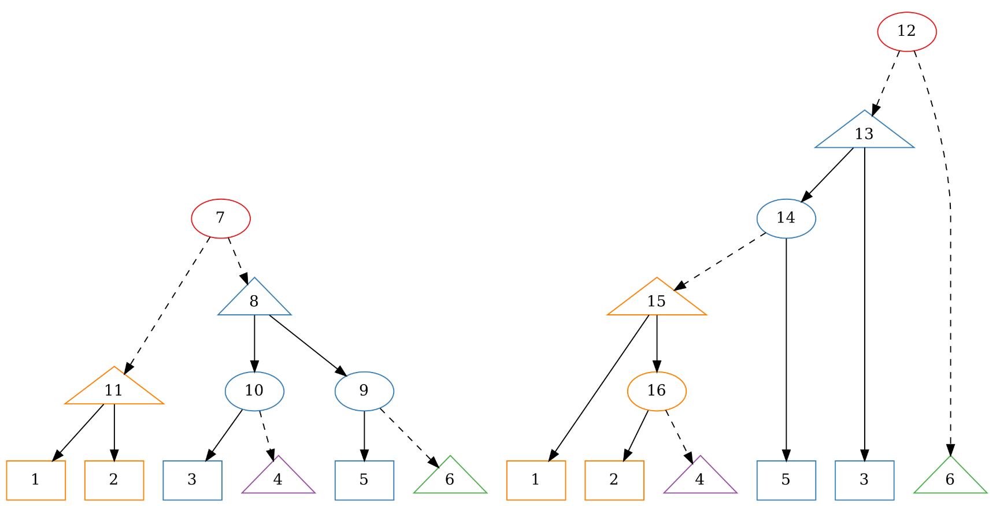

# STRIDE --- The PACE26 Maximum-Agreement Forest companion
The STRIDE system is designed as a companion to the [PACE 2026 challenge](https://pacechallenge.org/2026/) on [Maximum-Agreement Forest](https://pacechallenge.org/2026/maf/).
It provides a [large database of problem instances](https://pace2026.imada.sdu.dk) and solutions.
We hope that this will help to produce more general solvers that have fewer bugs.

The solutions are computed by the community (you!).
Since PACE is a competition, all solutions are kept secret until the end of the PACE challenge.
Until then, only the scores of the best solution sofar is made available.
Since solutions are verified upon upload to the server, the published scores have been certified.

After the challenge is completed, we will publish the solutions under a free license.
We hope to provide an interesting dataset (e.g., for machine learning) that way.

**The whole system is designed as a community effort.
If you are using the instances, we kindly ask you to share your solutions, especially if they are better than the ones we know so far.**

## Feature overview
The `stride` tool is build as a single statically linked executable (i.e., you can freely move the binary on your machine) and offers subcommands for several tasks:
- `stride run`: [Execute a solver](#runner) (in parallel), verify and summarize solutions
- `stride check`: [Check and visualize](#checker--visualizer) instances and solutions

You may use `stride --help` or `stride {subcommand} --help` for further information.

## Data protection
**We are not interested in your personal data** and designed the whole system in good faith to collect as little data as possible while still achieving the goals:
- Your solver never leaves your machine
- The runner only uploads normalized solutions (canonical leave and tree order stripped of any comments/stride lines), runtime, and error codes
- We do not gather any personal data or information about your compute infrastructure
- We do not store your IP address in our database (though we may enable short-term access logs for debugging purposes)

## Runner
The runner allows you to execute a solver on a set of instances.
In accordance with [optil.io](https://optil.io/optilion/help)'s signal handling, the runner supports soft timeouts (`-t`/`--timeout`) after which a `SIGTERM` is sent to the solver.
After another grace period (`-g`/`--grace`) the solver is sent a `SIGKILL` signal and all output is disregarded.
By default, instances are solved in parallel using one solver processor per physical CPU core (can be modified using the `-p`/`--parallel` argument).

```bash
# execute up to 123 solver instances in parallel, each with a soft timeout of 300s and a grace period of 5s
stride run -s ./mysolver -i instance.lst -t 300 -g 5 -p 123

# you may also pass arguments to your solver; any argument after `--` is forwarded to the solver.
stride run -s ./mysolver -i instance.lst -- --foo --bar --debug
```


### Specifying instances
As illustrates in the following example, there are multiple ways to specify the set of instances to be solved:

```bash
# explicitly specify instances
stride run -s ./mysolver -i tiny01.nw tiny02.nw

# using shell auto completes
stride run -s ./mysolver -i tiny*.nw

# using list files
stride run -s ./mysolver -i tiny.lst

# combining the above
stride run -s ./mysolver -i tiny.lst exact0?.nw onemore.nw
```

 - A list of instances path can be explicitly provided using the `-i`/`--instances` argument.
 - All file paths ending in `.lst` are interpreted as instance lists.
   A list file contains at most one entry per line.
   An entry can be:
   - a path to an instance
   - a path to another list
   - a glob string (e.g. `tiny0*.nw`)

Relative path in a list file are always interpreted relative to the list's path. 
If an instance is specified multiple times, it is only solved once; this allows the combination of overlapping lists.

### Environment variables for runner
Many of the common runner arguments can also be provided using environment variables:
```bash
export STRIDE_SOLVER=./mysolver
stride run -i instance.lst
```

A convenient way to select good defaults for your use case is also an [`.env` file](https://docs.rs/dotenvy/0.15.7/dotenvy/fn.dotenv.html) in the current working directory or its parents:

```bash
STRIDE_SOLVER=./mysolver
STRIDE_TIMEOUT=300
```

For a full list of supported environment variables use `stride run --help` and look out for `[env: ]` sections.

### Environment variables for solver
By default, a number of environment variables are set for the solver (pass `-E`/`--no-envs` to disble this feature). 
They are intended to ease solver development and **are not** available on `optil.io` or during the official PACE evaluation.

| Name                   | Description                                                                       |
|------------------------|-----------------------------------------------------------------------------------|
| `STRIDE_INSTANCE_PATH` | Path of the instance provided via STDIN                                           |
| `STRIDE_TIMEOUT`       | Soft timeout (in seconds), i.e. until `SIGTERM` arrives                           |                      
| `STRIDE_GRACE`         | Grace periode (in seconds), i.e. time after `SIGTERM` before `SIGKILL` arrives    |

## Communication with STRIDE server
We refer to instance files containing an `#s idigest` line as *STRIDE instances*; a large number of such instances is available at [STRIDE website](https://pace2026.imada.sdu.dk).

By default, the runner contacts the [STRIDE server](https://pace2026.imada.sdu.dk) about STRIDE instances (and only those!) to
 - upload canonical representations of valid solutions,
 - some error codes (to identify hard instances),
 - to retrieve the best known solutions.

The best known scores are directly reported by the runner (e.g., to discern between best-known and suboptimal solutions), and included in the [run summary](#run-summary).
Observe that the best known scores of heuristic instances should be treated with a grain of salt, since they might have been obtained using much more computation time than would be available during the competition. 

By passing the `-O`/`--offline` flag, no communication will take place.
We kindly ask you to not use this flag: building this infrastructure and solutions took quite some efforts.
If you are using STRIDE instances, please contribute your solutions! 

## Run log
The runner records a number of data points for you to inspect. They are placed in the directory `stride-logs/run_{DATE}_{TIME}` in the current working directory.
**Hint:** the symlink `stride-logs/latest` always points to the most recently started run.
Each run directory contains a number of files:
 - `messages.log` contains internal log messages; the level can be set using the `RUST_LOG` environment variable (supported values: `trace`, `debug`, `warn`, `info`, `error`) 
 - [`summary.json` is a machine-readable summary](#run-summary) of all tasks. It's intended to be used for your post-postprocessing. It includes detailed profiling data and debug data provided by your solver.
 - Each task (=solver run) is stored in its own folder that contains three files:
   - `stdout` contains the output of the solver augmented with profiling data (see [section Profiling](#profiling))
   - `stderr` contains infos written by the solver to stderr
   - `stdin` is a symlink to the instance file
 - While a task is being processed, its folder is kept in `tasks`.
   After the results could be assessed, the task is moved into a new folder which indicates its outcome (same names as used in [summary.json: `s_result`](#run-summary)).
   By default, the folders of tasks that produced a valid answer are deleted (they are kept if the `-k`/`--keep-logs` argument is provided).


### Run summary
We produce a machine-readable summary of each run in `stride-logs/{RUN}/summary.json`.
It's a newline delimited JSON file, where each line represents the result of a task (i.e. solver run) formatted in JSON.
That is, each line has to be parsed individually, the file itself is not a valid JSON expression.
Common data processing libraries natively support this format, e.g., [Polars](https://docs.pola.rs/api/python/stable/reference/api/polars.read_ndjson.html) and [Pandas](https://pandas.pydata.org/pandas-docs/stable/reference/api/pandas.read_json.html) (by setting `lines=True`).

By default, we record the following columns:

| Name            | Description                                                                     |
|-----------------|---------------------------------------------------------------------------------|
| `s_name`        | Name of instance (default: filename of instance)                                |                     
| `s_instance`    | Path to instance file                                                           |                                                 
| `s_stride_hash` | Hash value if instance is registered in the global stride database              | 
| `s_solution`    | Path to solution file (stdout)                                                  |  
| `s_score`       | If `s_result` indicates a valid solution, report the number of tree in the MAF. |
| ...             | [Profiling](#profiling) related columns                                         |

The column `s_result` can take the following values: 
 - `Valid`: the return solution is a feasible agreement forest (size is ignored)
 - `NoSolution`: the solution did not contain a single tree
 - `Infeasible`: the solution contained at least one tree
 - `InvalidInstance`: instance could not be parsed by stride
 - `SyntaxError`: at least one line could not be parsed; did you write a log message to stdout instead of stderr?
 - `SystemError`: e.g., solver or instance not found
 - `SolverError`: e.g., solver terminated with non-zero exit code
 - `Timeout`: a `SIGKILL` was sent
 
### Profiling
By default, (can be disabled using `--no-profile`) we collect performance metrics of the solver using POSIX's `getrusage` function and own measurements.

| Name | Description                                                                                                                             |
| ---- |-----------------------------------------------------------------------------------------------------------------------------------------|
| `s_wtime` | Walltime of solver run (end time - start time) in seconds                                                                               |
| `s_utime` | User time as reported by `getrusage` in seconds                                                                                         |
| `s_stime` | System time as reported by `getrusage` in seconds                                                                                       |
| `s_maxrss`| Maximum resident set size reported by `getrusage` **in bytes** (for portability). Small values of a few megabyte may not be reliable.   |
| `s_minflt`| Number of page reclaims (soft page faults)                                                                                              |
| `s_maxflt`| Number of page faults (hard page faults)                                                                                                |
| `s_nvcsw` | Number of voluntary context switches                                                                                                    |
| `s_nivcsw`| Number of involuntary context switches                                                                                                  |

### Report custom data
A solver may add additional data by emmiting stride lines in the following format:

```text
#s {KEY} {VALUE}
```

where `{KEY}` (without quotation chars! we test with `(a-zA-Z0-9_)+` but more is likely to work) is used as the key in summary log  and `{VALUE}` is a valid JSON expression.
If a key is present multiple time in a solution, only the last value will be reported.
For this reason avoid the prefix `s_` which is internally used by `stide`.


# Checker & Visualizer
The primary use case of the checker is to verify a solution computed by your solver by running
```bash
stride check <INSTANCE-PATH> <SOLUTION-PATH>
```

### Visualizing
By passing the parameter `-d/--export-dot` the checker will emit a visualization of a feasible solution in the [Graphviz DOT language](https://graphviz.org/doc/info/lang.html).
This feature is intended for small instances only.

You may directly pass the output into Graphviz's `dot` tool (there are also a number of online tools):
```bash
stride check --export-dot instance.nw solution.sol | dot -T pdf > solution.pdf
```

For the `tiny01.nw` instance this may yield:


- Each tree of the input is visualized independently where inner nodes are labelled according to the [PACE26 format specification](https://pacechallenge.org/2026/format/#indices-of-inner-nodes).
- Each tree of the solution corresponds to a fixed color (we currently only support ~8 colors).
- A triangular node indicate the root of a tree in the agreement forest; they are always connected to their parent (if any) by a dashed line.
- Removing dashed lines and contracting inner nodes with an out-degree of 1 yields the MAF.

### More checking
If the solution path is omitted, a number of linters and checks are carried out on the instance.
This feature is only useful if you create your own instances.

The optional `-p/--paranoid` enables additional linters/stricter rules (e.g., pertaining to whitespace).
The PACE rules *do not* require that solver solutions pass this stricter mode.

## Known limitations
Please check and contribute [issues](https://github.com/manpen/pace26stride/issues) and [pull requests](https://github.com/manpen/pace26stride/pulls).

### No Windows support
PACE uses the [optil.io](https://optil.io/optilion/help) conventions on signalling timeouts.
This intrinsically relies on POSIX signals, which seem to be unsupported in Windows. 
Hence, we only support Linux and OSX. 
